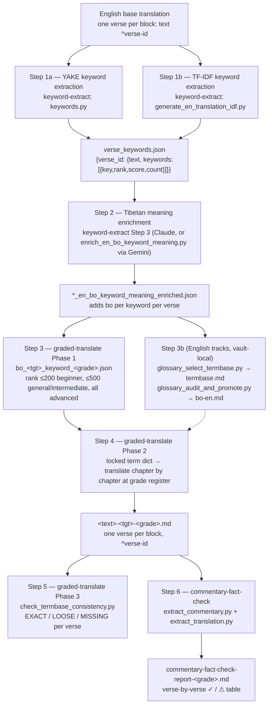

# Worked example — Keyword → Termbase → Translation → Fact-check

> **This is one vault's history, not the contract.** It records how the chain
> that `graded-translate` sits in was actually run in a single vault, with that
> vault's own pivot translation, target languages and helper scripts. It is
> kept because the shape of the chain is instructive and the failure modes it
> names are real. Nothing in it is required: the skill itself
> (`../SKILL.md`) is the authority on what a run must do, and it takes the
> pivot translation, the keyword source, the target languages and the grades as
> inputs. Read this for orientation, then follow the skill.

The end-to-end chain that `graded-translate` sits in, as it was run in the
vault this example comes from: a Tibetan root text, an existing block-aligned
English translation as pivot, and Hindi and Vietnamese graded tracks. Paths are
logical names from `rails/PROFILES.md`; `$KEYWORDS` is `2-RAILS/Keywords/` —
the directory `keyword-extract` writes to.



## Step 1 — Extract English keywords (`keyword-extract`)

Two interchangeable extractors consume the English base translation (parsed
verse by verse on the `^verse-id` markers) and produce the same shape.

**1a. YAKE** (`keywords.py`) — YAKE unigrams–trigrams, then spaCy lemmatisation
and stop-word filtering.

**1b. TF-IDF vs Reuters-21578** (`generate_en_translation_idf.py`) — term
frequency in the text × inverse document frequency in a 10,788-document
newswire corpus: words common in the text but rare in everyday English score
highest.

```json
{
  "6-22": {
    "text": "We don't get angry at bile and the like, even though they cause great suffering...",
    "keywords": [ { "key": "angry", "rank": 1, "score": 97141.66, "count": 1 } ]
  }
}
```

## Step 2 — Enrich keywords with their Tibetan meaning (`keyword-extract` Step 3)

Walk the keyword JSON alongside the Tibetan root and, verse by verse, record
the Tibetan word or phrase behind each English keyword *in that verse's
context* — not a dictionary lookup; the same English keyword can map to
different Tibetan lemmas in different verses.

```json
{ "key": "angry", "rank": 1, "score": 97141.66, "count": 1, "bo": "ཁྲོ་" }
```

## Step 3 — Build the target-language termbase (`graded-translate` Phase 1)

The enriched JSON is filtered by rank and given a rendering in the target
language, one file per grade. Rank cutoffs control how much vocabulary the
grade exposes: beginner keeps rank ≤ 200, general/intermediate ≤ 500, advanced
everything.

```json
{
  "1-1": {
    "text": "I bow down to the sugatas...",
    "bo_text": "བདེ་གཤེགས་ཆོས་ཀྱི་སྐུ་མངའ་སྲས་བཅས་དང༌། ...",
    "hi_text": "मैं सुगतों को...",
    "keywords": [
      { "key": "sugatas", "rank": 3, "bo": "བདེ་གཤེགས་", "hi": "सुगत", "grade": "beginner" }
    ]
  }
}
```

A parallel English-only branch existed in that vault: one script formalised
each English track's `termbase.md` from the master bilingual glossary
`$GLOSSARIES/<src>-en.md`, and another promoted terms used in a track but
missing from the master. Those scripts hard-coded that vault's track names and
file paths and stayed there; `bilingual-glossary` Phase 4 is the general form.

## Step 4 — Translate chapter by chapter (`graded-translate` Phase 2)

1. Load the grade file; build a flat `english_key → target rendering` dict
   (first occurrence wins). These are **locked** for the whole document.
2. Group verses by chapter, in the text's own order — read the chapter set off
   the root text's `^N-0` headings rather than assuming a numbering (that vault's
   was `0, I, 1–10, colophon`).
3. Translate each chapter's verses, substituting locked terms and writing in
   the grade's register (beginner Hindi glosses Sanskrit on first use:
   `बोधिचित्त (सबके भले की इच्छा)`; advanced keeps Sanskrit bare or expands it).
4. Re-scan the output for any verse where a locked term drifted to a synonym; fix it.
5. Write `$TRANSFORMATIONS/Translations/<tgt>-<grade>/<text>-<tgt>-<grade>.md`,
   one `<text> ^<verse-id>` block per verse, headings as `## text ^N-0`.

```
मैं सुगतों (यानी बुद्धों) को, जिनके पास धर्मकाय है, और उनकी संतान — बोधिसत्वों — को आदर से प्रणाम करता हूँ। ^1-1
```

## Step 5 — Mechanical consistency check (`graded-translate` Phase 3)

`check_termbase_consistency.py` catches vocabulary drift a proofreader would
otherwise have to eyeball across 900+ verses: for every verse it looks up
which lemmas the verse rail marks as load-bearing, checks each has a termbase
entry, then searches the verse's translated text for the locked rendering
(exact, or a loose article/plural-insensitive match).

```
verse    bo term                      expected                         result
1-1      byang chub sems              bodhicitta (l'esprit d'eveil)    OK
1-9      lha ma yin                   demi-dieu                        MISSING
```

Where no verse rails exist yet for a language, the grade file's own per-verse
keyword lists serve as the expectation (the manual pass in Step 4.4).

## Step 6 — Fact-check against the commentary (`commentary-fact-check`)

The accuracy backstop: not wording, but whether the translation says what the
commentary says the verse means.

```bash
python3 $SKILLS/commentary-fact-check/scripts/extract_commentary.py \
    $COMMENTARIES/Transcluded/<commentary>.md --json $WORK/commentary.json
python3 $SKILLS/commentary-fact-check/scripts/extract_translation.py \
    $TRANSFORMATIONS/Translations/<tgt>-<grade>/<text-id>-<tgt>-<grade>.md --chapter 1 --json $WORK/<tgt>_ch1.json
```

Each verse gets ✓ if the commentary's content (similes, named entities,
enumerations) is present, or ⚠ with a concrete note. Verdicts accumulate in
one report per grade/language:

```
| Verse | Verdict | Note |
| 1-9   | ⚠ | Hindi names two groups (gods, humans); commentary names three
              (gods, demigods/asuras, humans) — "lha dang lha min dang mir bcas pas" |
**Result: 35/36 confirmed, 1 discrepancy.**
```

## Summary

| Stage | Skill / script | Input | Output |
|---|---|---|---|
| 1. Keyword extraction | `keyword-extract` (`keywords.py` / `generate_en_translation_idf.py`) | English base .md | `*_verse_keywords.json` |
| 2. Tibetan enrichment | `keyword-extract` Step 3 | keyword JSON + root text | `*_en_bo_keyword_meaning_enriched.json` |
| 3. Target termbase | `graded-translate` Phase 1 | enriched JSON, rank cutoff, attested translation | `bo_<tgt>_keyword_<grade>.json` |
| 4. Translation | `graded-translate` Phase 2 | grade file | `<text>-<tgt>-<grade>.md` |
| 5. Consistency check | `graded-translate` Phase 3 (`check_termbase_consistency.py`) | termbase + translation (+ rails) | EXACT / LOOSE / MISSING per verse |
| 6. Fact-check | `commentary-fact-check` | commentary + translation | `commentary-fact-check-report-<grade>.md` |
